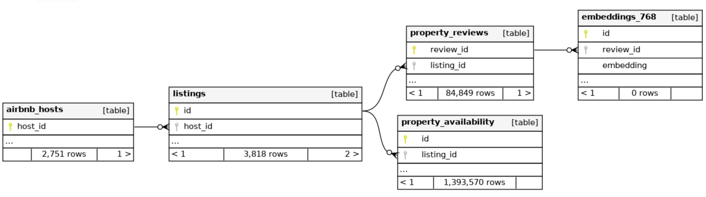

# Semantic_sql_examples
Semantic SQL examples using PostgreSQL pgvector and AirBnB review embeddings


### Summary

These experiments use the contents of the 
[Seattle AirBnB](https://www.kaggle.com/datasets/airbnb/seattle/data) dataset
which are deposited into a database for further processing and exploration.
(The original Kaggle dataset was contained in csv files, but the 
[Seattle_AirBnB_ETL](https://github.com/mileslucey/Seattle_AirBnB_ETL)
repo had a nice setup to load that into database, albeit written for MySQL.
The version of it in here was updated to repull the original Kaggle dataset
and work for PostgreSQL instead.)
A language-embeddings model is run on each review comment to produce
an embedding vector that gets saved to the database.
Then using PostgreSQL's pgvector extension enabling fast & efficient vector
cosine similarity computation, various SQL queries are run on the database
contents to explore semantic-search examples.

The Usage section below provides line-by-line copy and paste instructions
to run the contents of this repo.  The Example Results section after that
shows example output from the three query examples in the `example_queries`
subdirectory demonstrating the semantic-search explorations.

The database has the relationships form seen below, so note that while not
a theme in the current example queries, a big advantage of doing these types
of queries fully in database is that the query can include both filtering on
other relationships (e.g. only listings in a certain neighborhood or under
a certain price) and also the similarity/proximity calculations, potentially
making an enormous difference in the amount of data pulled.




### Usage

  1. Create and enter Python virtual environment
      - `python3.12 -m venv .venv`
      - `source .venv/bin/activate`
      - `pip install -r requirements.txt`

  2. Only needed once: download the models and dataset
      - `python download_model_and_data.py`
      - this script pulls the Kaggle Seattle AirBnB dataset from the Kaggle API
        and the OpenCLIP ViT-L-14 model and Sentence Transformers E5-base-v2
        model from HuggingFace, to be stored and used locally.
      - in the console output from that run, find the long OpenCLIP model path
        string and paste into config.py under CLIP_PATH (only needed for that
        model due to its funny uuid-like path it gets downloaded to).

  2. Create database and prep/load Airbnb data into it
      - assuming that you have a PostgreSQL database system running/available
      - you might need to update database connect string in `config.py` to match
        your setup; by default it assumes a `~/.pgpass` file exists containing
        a corresponding line like
        `localhost:5432:seattle_airbnb_db:script_runner:yourpasswordhere`.
      - `createdb.sql` is called via `\i /path/to/createdb.sql` in `psql` to
        create the `seattle_airbnb_db` database and its schema.
      - `python etl_data.py` cleans the CSV contents and writes
        listings/hosts/reviews/availability data into the database

  3. (Optional) Document the DB schema
      - `docker-compose.yaml` runs SchemaSpy and writes the generated schema
        docs into `spy_data/`.

  4. Create embeddings
      - `python compute_review_embeddings.py` runs embedding model on review
        comments and saves results into the `embeddings_768` table.
      - `python compute_semaxis_embeddings.py` runs embedding model on a
        handful of arbitrary words and phrases meant as seed values to define
        "semantic axis pole pairs", such as "clean" vs "dirty", and saves them
        in the `embeddings_768` table.  one can easily add/change these seeds
        at top of that script.
      - by default the OpenCLIP ViT-L-14 model is set in `config.py` since it's
        really fast and requires little compute resources.  after trying that
        one you can change the EMBED_TYPE in config.py from CLIP to E5 and rerun
        `compute_review_embeddings.py` and `compute_semaxis_embeddings.py` -
        the EMBED_TYPE is written with the embedding records and filtered in
        the example queries, so both can be in the database.  adding some other
        model (eg OpenAI API?) is readily done in `embedding_helper.py` by
        following the pattern in that module, which encapsulates the models
        so that nothing need be done outside it.  The only constraint is that
        the embeddings_768 table expects vector length of 768; no problem to
        change that length & table name (and fyi some variable names have '768'
        in them), it's just multiple model results in that table must have same
        length.
      - on my MacBookPro-M2-2022 that OpenCLIP model takes about 43 minutes to
        compute the embeddings for the 84849 reviews, and the E5 model takes
        about 4 hours to do so.

  5. Create clusters
      - `python cluster.py` runs the clustering routine (extract, PCA, UMAP,
        HDBSCAN) and then injects the cluster_num results back into the database
        as new json keys in the embeddings_768.tag field.  On my same
        MacBookPro-M2-2022 that run took about 20 min.

  6. Tweak and run the example queries
      - if you use PostgreSQL then surely you have `psql` (PostgreSQL's CLI
        client).  while not required to use that, I do myself, so when I refer
        to lines like `\i example_queries/top5_closest_farthest.sql`, that's
        just `psql`'s command to "input" (\i) that SQL query in that file.
        but you could use whatever PostgreSQL client.
      - the example queries all begin with a small `config` CTE where you can
        tweak a few main inputs to the queries, as described in their comments.


### Example Results

These example results from the three query examples in the `example_queries`
subdirectory give an idea of the kinds of semantic-search explorations that can
be done purely in SQL queries if PostgreSQL's pgvector extension is installed.
Entirely in database; just needs the embedding vectors to be externally computed
and inserted.  So note all the above Usage instructions must be completed first
to run these example queries.


#### Reviews whose embeddings are 5-closest and 5-farthest from a source comment
For example, in this run the negative "host cancelled" theme of the source
comment was found in the closest comments, and contrasted glowing compliments
in the farthest comments.
```
\i example_queries/top5_closest_farthest.sql   -- with src.eid = 98297
┌──────────────────────────────────────────────────────────────────────────────────┬────────────┬───────┬────────────────┬───────────────┐
│                                     comment                                      │ similarity │ count │ last_review_id │ last_embed_id │
├──────────────────────────────────────────────────────────────────────────────────┼────────────┼───────┼────────────────┼───────────────┤
│ The host canceled this reservation 13 days before arrival. This is an automated  │      1.000 │     1 │       58458460 │         98297 │
│ ---                                                                              │            │       │                │               │
│ The host canceled this reservation [X] days before arrival. This is an automated │      1.000 │   362 │       58612186 │         98328 │
│ The host canceled this reservation the day before arrival. This is an automated  │      0.957 │    57 │       58256584 │         98218 │
│ The reservation was canceled [X] days before arrival. This is an automated posti │      0.916 │   396 │       31614258 │         54994 │
│ The reservation was canceled the day before arrival. This is an automated postin │      0.875 │    56 │       31688399 │         55087 │
│ The host canceled my reservation [X] days before arrival.                        │      0.852 │    18 │         769194 │         14864 │
│ ...                                                                              │            │       │                │               │
│ Shawn's wonderful place in the Fremont neighborhood delighted us from the moment │      0.097 │     1 │       26832019 │         48546 │
│ Amanda's place in Ballard was exactly as described—lovely, quiet, and peaceful.  │      0.115 │     1 │       28857701 │         51580 │
│ Elena's attention to detail was impeccable! Charcoal for the grill️ toiletries️    │      0.117 │     1 │       43388601 │         75138 │
│ Es war ein sehr nettes Erlebnis. Das Häuschen im Garten war charmant. Es tat gut │      0.138 │     1 │       18001967 │         35868 │
│ Lacy og Kyle gav os en dejlig velkomst ved at tage sig god tid til at vise os le │      0.143 │     1 │       39198926 │         67850 │
└──────────────────────────────────────────────────────────────────────────────────┴────────────┴───────┴────────────────┴───────────────┘
```

#### Inspecting comments grouped into clusters that were generated by cluster.py
For example, in this run Cluster 40 appeared to be about cabins:
```
\i example_queries/get_cluster.sql   -- with cluster_num = 40
┌──────────┬───────────┬───────────────────────────────────────────────────────────────────────────────────────────────┬───────────────────────────────────────┐
│ embed_id │ review_id │                                           comments                                            │                  tag                  │
├──────────┼───────────┼───────────────────────────────────────────────────────────────────────────────────────────────┼───────────────────────────────────────┤
│    19865 │   4932177 │ As always my eight year old daughter loved staying at the cabin, fishing, canoeing, captur... │ {"cluster": 40, "embed_type": "CLIP"} │
│    21222 │   5964382 │ Our only regret is that we couldn't stay longer!! This cabin is beyond charming and the ba... │ {"cluster": 40, "embed_type": "CLIP"} │
│    21995 │   6528575 │ Roberta & Dan are great! Their cabin was wonderful! Amazing woodwork and beautiful stone..... │ {"cluster": 40, "embed_type": "CLIP"} │
│    23071 │   7336446 │ Gillian's Sky Cabin is a dream. We loved everything from the location to the amenities. If... │ {"cluster": 40, "embed_type": "CLIP"} │
│    23663 │   7909018 │ I LOVED this place. Super clean, toasty warm (thanks to the roaring fire that was already ... │ {"cluster": 40, "embed_type": "CLIP"} │
│    24388 │   8625191 │ I wanted to take a retreat from work and instead of driving a long distance or flying some... │ {"cluster": 40, "embed_type": "CLIP"} │
│    25043 │   9292159 │ The cabin was fantastic. So quaint with the wood burning fireplace and the beautiful view.... │ {"cluster": 40, "embed_type": "CLIP"} │
│    26003 │  10265299 │ Wow! This is like a cottage out of a fairy tale. Completely private, among tall trees with... │ {"cluster": 40, "embed_type": "CLIP"} │
│    26171 │  10416488 │ I had really high expectations of this place, having seen the pictures on the airbnb listi... │ {"cluster": 40, "embed_type": "CLIP"} │
│    28825 │  12964805 │ Talk about the fabulous life of Susanna and Ricki! The fiber glass lamps, velvet couch, th... │ {"cluster": 40, "embed_type": "CLIP"} │
│    35416 │  17669832 │ Roberta and Dans cabin was the last stop of our america-trip and we couldn't have chosen b... │ {"cluster": 40, "embed_type": "CLIP"} │
│      ... │       ... │ ...etc...                                                                                     │ ...                                   │
```

#### Projecting review comments onto "semantic axes" such as "clean" vs "dirty"
For example, in this run the semantic axis "clean" vs "dirty" appeared to work
pretty accurately, but to do so required using the seed poles which were the
whole-sentence versions of "clean" and "dirty" rather than single words version
(ie abssemaxis=18 rather than abssemaxis=8 in `compute_semaxis_embeddings.py`).
The `comment_len` field (comment length ie number of characters) helped in
analyzing the patterns in short/single-word seed poles associating with
short/single-word comments regardless of comment topic (not shown here).
```
\i example_queries/sem_axis_query.sql   -- with abssemaxis = 18 (clean/dirty sentences)
┌─────────────┬────────────────────────────────────────────────────────────────────────────────────────────┬───────┬────────────┬───────┬────────────────┬───────────────┐
│ comment_len │                                          comment                                           │ etype │ axis_value │ count │ last_review_id │ last_embed_id │
├─────────────┼────────────────────────────────────────────────────────────────────────────────────────────┼───────┼────────────┼───────┼────────────────┼───────────────┤
│         149 │ Beautiful home with clean lines and safety options. It was exactly as pictured and would c │ CLIP  │     0.2050 │     1 │       40588992 │         70351 │
│          49 │ Great and very clean space in a perfect location!                                          │ CLIP  │     0.2019 │     1 │       14542067 │         30769 │
│          68 │ Clean and attractive space, sweet neighborhood and responsive hosts.                       │ CLIP  │     0.1983 │     1 │       26420922 │         47971 │
│          73 │ A great and very efficient space that's private and very well maintained.                  │ CLIP  │     0.1926 │     1 │       16106530 │         32927 │
│         190 │ A beautiful modern townhouse that lives up to its reviews. Very clean, great light, awesom │ CLIP  │     0.1908 │     1 │       12156487 │         28109 │
│          79 │ Bright, clean, quiet space. Perfect location, exactly what we were looking for.            │ CLIP  │     0.1884 │     1 │       33041863 │         56991 │
│         113 │ Very clean and simple. Fit our needs perfectly. Much better than a hotel room and in a coo │ CLIP  │     0.1879 │     1 │       50696063 │         87825 │
│          41 │ The space was clean, clear and beautiful.                                                  │ CLIP  │     0.1852 │     1 │       30009628 │         53003 │
│         124 │ Perfectly comfortable with every amenity we needed. The space was clean, and cozy and just │ CLIP  │     0.1831 │     1 │       27864817 │         49804 │
│          42 │ Very comfortable, clean and inviting home!                                                 │ CLIP  │     0.1828 │     1 │       44254036 │         76569 │
│             │ ...                                                                                        │ ...   │            │       │                │               │
│         119 │ The house was dirty every where when we arrived. The owner promised let me get a refund, b │ CLIP  │    -0.1583 │     1 │       48484980 │         84120 │
│         146 │ We are really dissapointed. The bathroom was very dirty. The house smelt not well. The hal │ CLIP  │    -0.1471 │     1 │       50785364 │         87971 │
│         124 │ The bathroom was dirty and the pillows and sleeping bags that were provided were also dirt │ CLIP  │    -0.1301 │     1 │       27508907 │         49339 │
│         974 │ We arrived to a very dirty house, all of the trash that was left from the previous renters │ CLIP  │    -0.1252 │     1 │       30927806 │         54284 │
│        2493 │ The most amazing view and a fantastic location from which to see and experience the city.  │ CLIP  │    -0.1231 │     1 │       54969102 │         94184 │
│         869 │ Location is directly below major freeway #5. No air conditioning, and suite was 86 degrees │ CLIP  │    -0.1199 │     1 │       40931176 │         70917 │
│         124 │ Grt location, but the house needs some TLC! Carpet was dirty, sinks slow, walls need paint │ CLIP  │    -0.1188 │     1 │       51734909 │         89536 │
│         505 │ I'm sorry to say that our stay was less than desirable. The house, albeit old, was in a so │ CLIP  │    -0.1136 │     1 │       18006701 │         35878 │
│         199 │ This is not a nice house to stay in. It’s old. A lot of the furniture is damaged and it sm │ CLIP  │    -0.1110 │     1 │       34800475 │         59937 │
│        2106 │ While the location of this place is great, we had lots of difficulties with the hostess. I │ CLIP  │    -0.1102 │     1 │       32507141 │         56219 │
└─────────────┴────────────────────────────────────────────────────────────────────────────────────────────┴───────┴────────────┴───────┴────────────────┴───────────────┘
```

